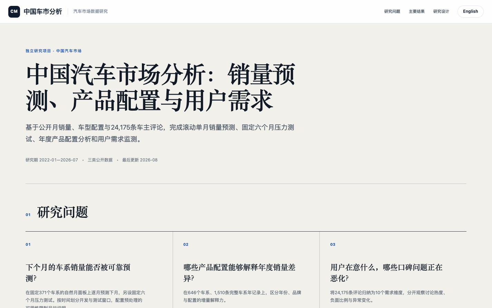
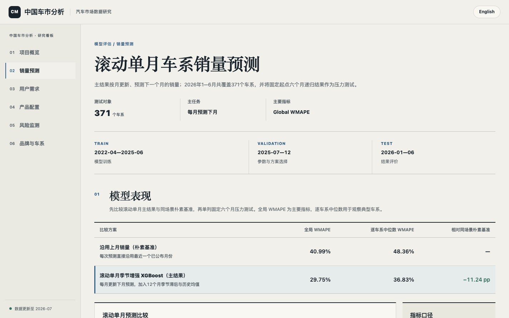
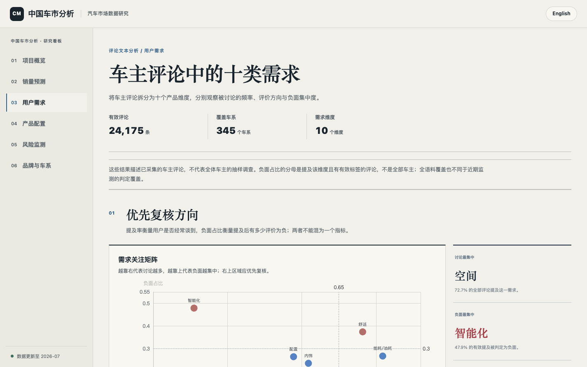
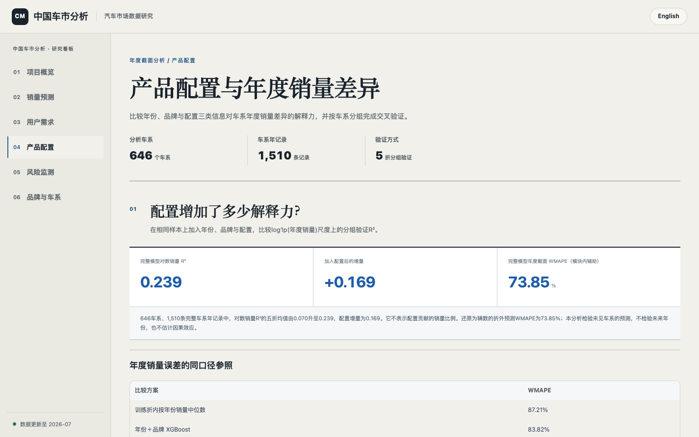
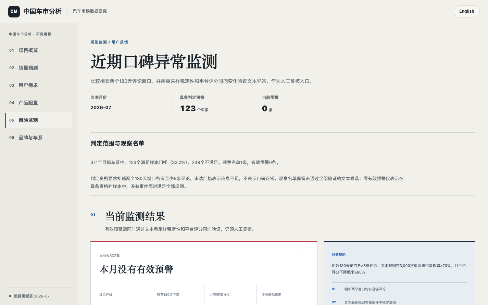
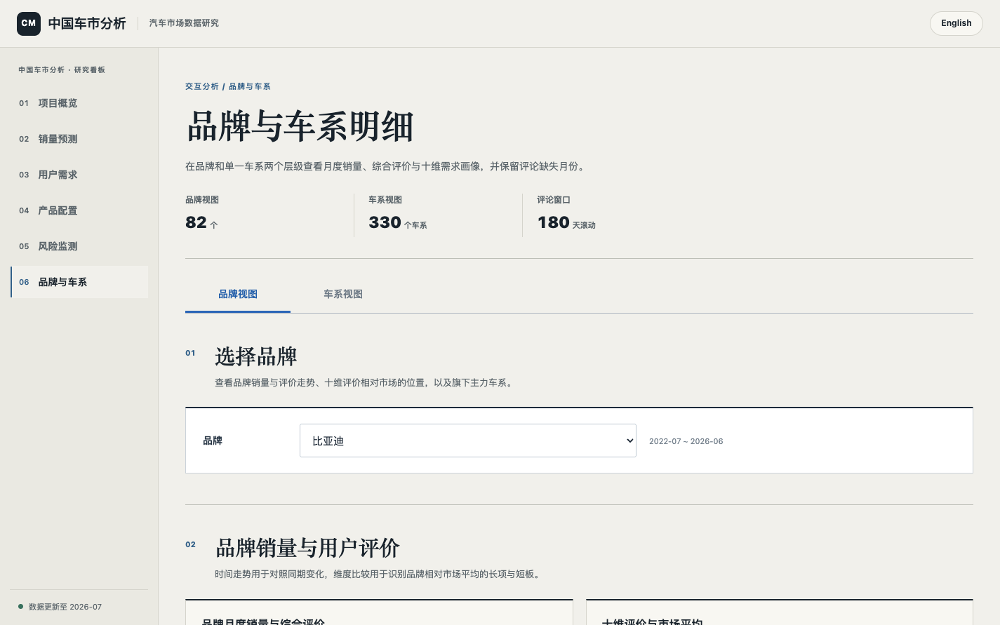

<p align="center">
  <a href="./README.md">中文</a> · <a href="./README_EN.md">English</a>
</p>

<h1 align="center">中国汽车市场分析：销量预测、产品配置与用户需求</h1>

<p align="center">
  基于公开月销量、车型配置与 24,175 条车主评论的汽车市场研究项目
</p>

<p align="center">
  <a href="https://yemyu.github.io/china-auto-market-analysis/"><b>在线研究看板</b></a>
  ·
  <a href="./notebook/China_Auto_Market_Analysis.ipynb">分析 Notebook</a>
  ·
  <a href="./data/README.md">数据文档</a>
</p>

---

## 项目概览

项目分为三部分：

| 模块 | 样本 | 研究内容 | 验证方式 |
|---|---:|---|---|
| 六个月销量预测 | 371 个车系 | 比较销量历史、产品属性和用户评价对预测的贡献 | 固定起点递归预测；按时间划分训练、验证、测试 |
| 产品配置分析 | 736 个车系，2,007 条车系年记录 | 估计年份、品牌与产品配置对年度销量差异的增量解释力 | `GroupKFold(5)` 按车系分组 |
| 用户需求与风险 | 24,175 条评论，覆盖 345 个车系 | 识别十类产品需求、负面集中度和口碑异常 | 结构校验、抽样审计、相邻 180 天窗口监测 |

三项分析采用不同筛选条件。销量预测要求连续的月度历史和可用配置；产品配置分析只要求车系年销量与配置能够对齐；用户需求分析以可核验的完整评论为准。

## 主要结果

### 销量预测

最终测试区间为 2026 年 1—6 月，371 个车系共 2,226 个车系月观测。主指标采用全局 volume-weighted WMAPE，同时保留逐车系中位数 WMAPE。

| 方案 | 全局 WMAPE ↓ | 逐车系中位数 WMAPE ↓ | 相对销量基线 |
|---|---:|---:|---:|
| 销量基线模型 | 40.44% | 49.98% | — |
| 用户口碑增强模型 | 38.71% | 48.83% | −1.73 pp |
| 冷启动补充方案 | **38.64%** | **48.32%** | −1.80 pp |

用户评价带来小幅改善信号，但并未取代历史销量：按车系重采样的 95% 区间为 −0.78 至 5.02 个百分点，仍跨过零。冷启动补充主要改善 9 个历史不足车系，对整体指标的进一步提升为 0.06 个百分点。

### 产品配置

在同一组 736 个车系上逐步加入年份、品牌和配置：

| 特征组合 | 分组交叉验证 R² | WMAPE |
|---|---:|---:|
| 年份 | 0.089 | 87.67% |
| 年份 + 品牌 | 0.156 | 83.92% |
| 年份 + 品牌 + 配置 | **0.300** | **75.69%** |

产品配置带来 `+0.144` 的 R² 增量，说明它能够解释一部分车系间年度销量差异。这里衡量的是样本外解释关联，不作因果推断。

### 用户需求与风险

评论被拆分为空间、动力、操控、舒适、能耗、配置、智能化、性价比、外观和内饰十个维度，并分别记录是否提及、正负倾向与时间窗口。最近一个完整监测月为 2026 年 7 月；123 个车系达到监测样本门槛，当前有 1 条规则预警进入人工复核。

## 研究设计

### 时间切分与防泄漏

| 数据段 | 时间 | 用途 |
|---|---|---|
| Train | 截至 2025-06 | 模型训练 |
| Validation | 2025-07—12 | 参数与方案选择 |
| Test | 2026-01—06 | 最终评价 |

六个月测试采用 2026 年 1 月固定起点递归预测。用于测试的评论特征冻结在预测起点：任何 2026 年 1 月 1 日之后发布的评论都不会进入这组主结果。滚动起点结果仅作为补充分析。

### 用户评论处理

严格语料只保留有完整正文、发布时间和可审计来源的评论；103 条只有列表摘要、无法取得详情正文的记录被保留在采集审计中，但不进入模型。最终语料为 24,175 条，覆盖 345 个目标车系，其中 330 个车系在测试起点前已有可用评论。

评论标签按十个产品维度保存，平台评分与文本评价分开处理。用于建模的月度特征包含历史评论量、维度得分、正负比例和统一口径的提及率；缺失评论保持为缺失及可用性标记，不填成中性。

### 指标口径

全局 WMAPE 定义为：

```text
Σ |实际销量 − 预测销量| / Σ 实际销量
```

该指标按真实销量加权，适合观察整体市场误差。逐车系中位数 WMAPE 用于补充长尾车系表现；年度配置分析另报告分组交叉验证 R²。

## 看板

看板由原生 HTML、CSS、JavaScript 与 ECharts 构建，数据预先写入 `app/static/data/`，不依赖后端服务。中文与英文共用同一套数据，包含项目概览、销量预测、用户需求、产品配置、风险监测以及品牌与车系明细六页。

<details open>
  <summary><b>功能截图</b></summary>

<br>

<table>
  <tr>
    <td width="50%"><a href="./assets/dashboard/zh/01-overview.png"></a></td>
    <td width="50%"><a href="./assets/dashboard/zh/02-sales-forecast.png"></a></td>
  </tr>
  <tr><td align="center">项目概览</td><td align="center">销量预测</td></tr>
  <tr>
    <td><a href="./assets/dashboard/zh/03-user-needs.png"></a></td>
    <td><a href="./assets/dashboard/zh/04-product-config.png"></a></td>
  </tr>
  <tr><td align="center">用户需求</td><td align="center">产品配置</td></tr>
  <tr>
    <td><a href="./assets/dashboard/zh/05-risk-monitor.png"></a></td>
    <td><a href="./assets/dashboard/zh/06-brand-series.png"></a></td>
  </tr>
  <tr><td align="center">风险监测</td><td align="center">品牌与车系（比亚迪示例）</td></tr>
</table>

</details>

## 快速开始

创建项目环境：

```bash
conda env create -f environment.yml
conda activate nlp-sentiment
```

直接预览看板：

```bash
python -m http.server 8000 --directory app
```

打开 <http://127.0.0.1:8000/>。看板数据已经预烘焙，无需先运行采集或建模脚本。

重新生成看板数据：

```bash
python app/build_dashboard_data.py
```

流水线脚本位于 `scripts/`。关键阶段包括：

```text
00—14  车系索引、销量面板、时间切分与基础模型
15—28  评论采集、车系映射、语料质量与评论特征
29     产品配置年度归因
30—37  评论标签合并、预测消融、稳健性、用户需求、冷启动与报告 Notebook
```

所有 Python 脚本均按以下方式执行：

```bash
python scripts/<script>.py
```

## 目录

```text
china-auto-market-analysis/
├── app/                    静态研究看板与预烘焙 JSON
├── assets/                 分析图与看板截图
├── data/
│   ├── raw/                月销量与车型配置原始表
│   ├── reviews/            评论语料、标签与时间特征
│   ├── processed/          时间切分、模型结果与审计产物
│   └── resources/          历史评论资源
├── notebook/               中英文分析 Notebook
├── scripts/                可复现脚本
├── environment.yml
├── requirements.txt
├── README.md
└── README_EN.md
```

## 数据与许可

月销量、车型配置和车主评论来自公开汽车平台。原始平台数据版权归相应来源方；仓库中的数据仅用于学习、研究与项目展示，不用于商业用途。代码与项目文档采用 MIT License。

更完整的表结构、样本筛选、时间可用性和资源归档说明见 [data/README.md](./data/README.md)。
