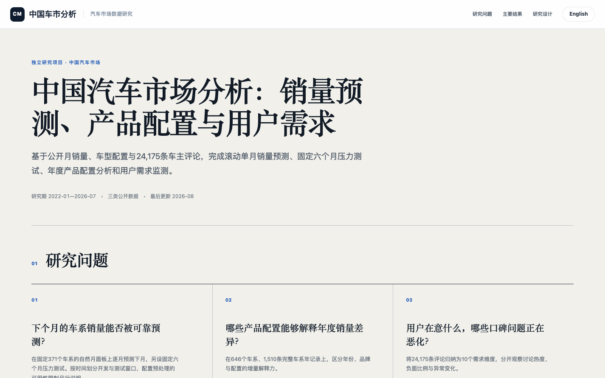
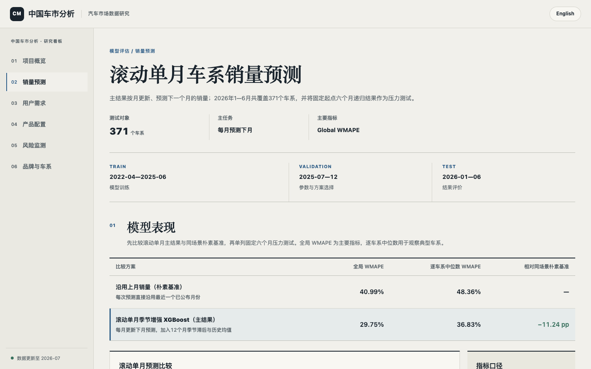
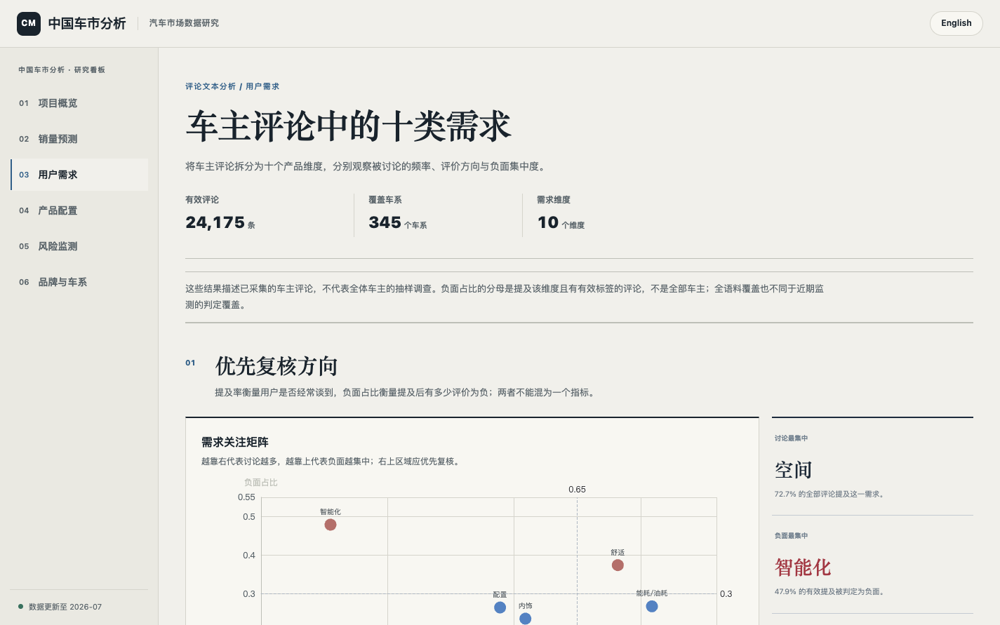
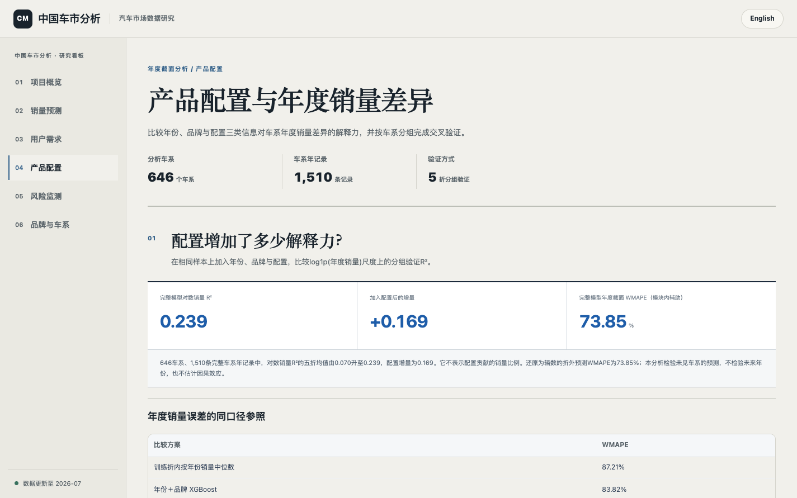
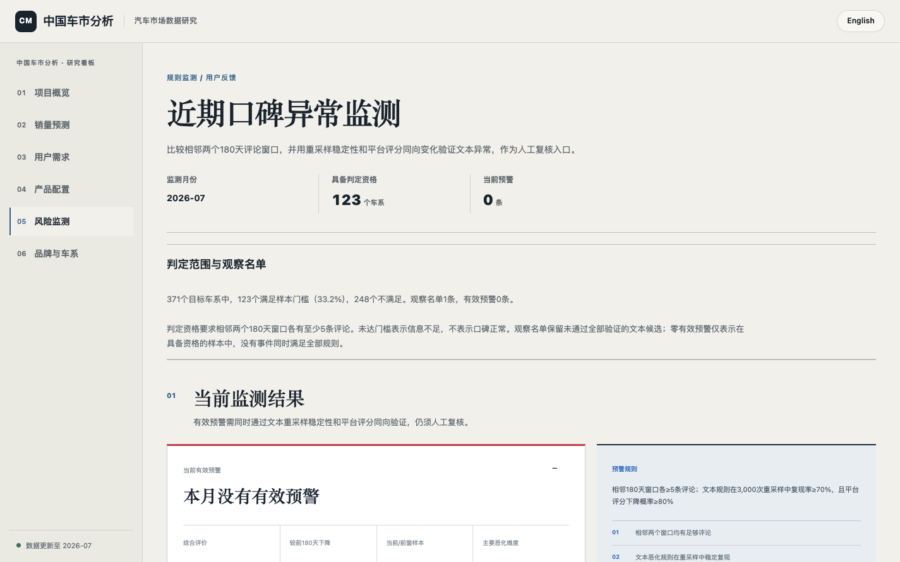
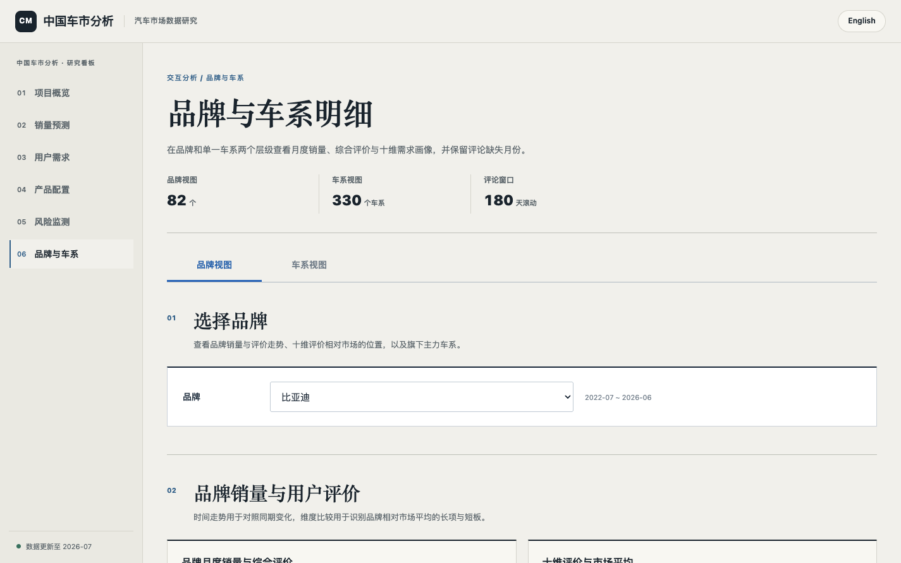

<p align="center">
  <a href="./README.md">中文</a> · <a href="./README_EN.md">English</a>
</p>

<h1 align="center">🇨🇳 中国汽车市场分析：销量预测、产品配置与用户需求</h1>

<p align="center">基于公开月销量、车型配置与 24,175 条车主评论的汽车市场研究项目</p>

<p align="center">
  <a href="https://yemyu.github.io/china-auto-market-analysis/"><b>在线研究看板</b></a>
  · <a href="./notebook/China_Auto_Market_Analysis.ipynb">分析 Notebook</a>
  · <a href="./data/README.md">数据文档</a>
</p>

---

> **项目简介**　使用公开月销量、车型配置和车主评论，研究车系销量的短期变化、产品属性与年度销量的关系，以及用户反馈中的需求和问题。

## 研究问题

1. 📈 在每月更新信息的情况下，下个月的车系销量能否稳定预测？
2. 🧩 哪些产品配置能够解释不同车系之间的年度销量差异？
3. 💬 用户最在意哪些产品维度，哪些口碑信号值得进一步复核？

## 分析内容

| 模块 | 样本 | 研究内容 | 当前口径 |
|---|---:|---|---|
| 📈 滚动单月销量预测 | 371 个车系 | 使用最新已公布销量预测下月 | 主结果；完整月度面板与时间划分 |
| 🧪 固定六个月压力测试 | 同一 371 个车系 | 一次性从 2026-01 递归预测六个月 | 辅助场景；与主结果分开评估 |
| 🧩 产品配置分析 | 646 个车系，1,510 条完整车系年记录 | 估计年份、品牌与配置对年度销量差异的增量解释力 | 2022—2025 完整自然年；`GroupKFold(5)` 按车系分组 |
| 💬 用户需求与风险 | 24,175 条评论，覆盖 345 个车系 | 识别十类产品需求、负面集中度和口碑异常 | 结构校验、抽样审计、相邻 180 天窗口 |

销量预测使用固定车系的完整自然月面板；配置分析使用销量与配置可对齐的完整年度记录；用户需求分析使用正文完整、来源可核验的评论。各模块的筛选条件和输入字段见[数据文档](./data/README.md)。

## 核心指标

| 关键结论 | 当前结果 |
|---|---:|
| 📈 滚动单月主结果 | **29.75% WMAPE**，比上月销量基准低 11.24 个百分点 |
| 🧪 固定六个月压力测试 | **38.09% WMAPE**，比最近十二个月均值减少 43.5% 绝对误差 |
| 🧩 年度配置模型 | 对数销量分组交叉验证 R² **0.239**；加入配置的增量 **+0.169** |
| 💬 用户需求监测 | 24,175 条评论、10 个维度、123 个达标车系 |

## 主要结果

### 1. 📈 销量预测

测试窗口为 2026 年 1—6 月，共 371 个车系、2,226 个车系月。主任务是每月更新的下月预测；固定起点六个月结果作为压力测试。主指标为全局 volume-weighted WMAPE，逐车系中位数用于补充观察长尾。

#### 滚动单月主结果

| 方案 | 全局 WMAPE ↓ | MAE（辆）↓ | RMSE（辆）↓ | 逐车系中位数 WMAPE ↓ |
|---|---:|---:|---:|---:|
| 沿用上月销量 | 40.99% | 975.19 | 2,668.17 | 48.36% |
| 近3个月均值 | 43.61% | 1,037.52 | 2,614.45 | 53.66% |
| 近6个月均值 | 51.21% | 1,218.19 | 2,892.08 | 64.45% |
| 去年同期销量 | 73.88% | 1,757.68 | 3,590.51 | 100.00% |
| **季节增强 XGBoost** | **29.75%** | **707.68** | **1,700.38** | **36.83%** |

MAE 和 RMSE 的单位为辆，按车系月计算。模型相对上月销量基准减少 27.4% 的绝对误差；绝对误差中位数为 139 辆，第 90 百分位约 1,960 辆。

**历史回测与模型选择。** 在 2024-01、2024-07、2025-01、2025-07 四个起点，分别回测随后六个月的滚动单月预测。基础 XGBoost 使用 1/2/3 月滞后、3/6 月均值、日历和配置；季节方案增加 12 月滞后和 12 月均值，并调整树深、树数等参数。该比较同时包含特征和参数变化。

历史窗口合并 WMAPE 由 24.30% 降至 23.35%，改善 0.957 个百分点；最差单窗口退化 0.061 个百分点，满足预设的“合并改善至少 0.5 个百分点、单窗口退化不超过 1 个百分点”条件。选定后使用截至 2025-12 的数据重新拟合；2026-01—06 保持模型权重和参数不变，每月更新销量历史。起点明细和参数见 [Notebook](./notebook/China_Auto_Market_Analysis.ipynb) 与[评估摘要](./data/processed/forecast/rolling_origin_summary.json)。

**分月与分组误差。** 模型在六个测试月中的五个月优于上月销量基准；5 月 WMAPE 为 21.77%，基准为 21.02%。按测试前半年平均销量划分四分位组，最低销量组的 WMAPE 为 66.60%，最高销量组为 28.02%。逐月、分组及零销量诊断见 Notebook。

| 其他误差视角 | 上月销量基准 | 季节增强 XGBoost |
|---|---:|---:|
| 正销量 MAPE（1,964 行）↓ | 255.51% | 179.75% |
| sMAPE（全部 2,226 行）↓ | **52.44%** | 61.39% |
| 按月汇总 371 个车系后的 WMAPE ↓ | 28.32% | **6.46%** |
| 六个月累计净偏差（预测−实际） | +9.54% | −0.67% |

sMAPE 对真实值为零、预测为正的记录计 200%。在 262 个零销量车系月中，模型 MAE 为 23.06 辆，基准为 34.87 辆；模型更常产生小幅正预测，因而 sMAPE 较高。按月汇总的 WMAPE 衡量样本车系的月度总量误差，累计净偏差则衡量半年总体高估或低估，两者均允许个体误差抵消。

#### 固定六个月压力测试

| 方案 | 全局 WMAPE ↓ | 逐车系中位数 WMAPE ↓ |
|---|---:|---:|
| 固定起点最近 6 个月均值（朴素） | 69.31% | 89.60% |
| 固定起点最近 12 个月均值（朴素） | 67.43% | 89.40% |
| 固定六个月平台评分模型（XGBoost） | **38.09%** | **48.18%** |

平台评分模型 MAE 为 906.21 辆，相对近 12 个月均值减少 43.5% 的绝对误差。该均值是保存的朴素方法中测试 WMAPE 最低的描述性参照；平台评分方案在开发阶段选定。全部朴素方法见[固定场景比较表](./data/processed/forecast/forecast_benchmark_comparison.csv)。

**口碑特征比较。** 销量基线、平台评分、本地词典、文本及组合口碑方案均使用 XGBoost，保持开发阶段选定的平台评分方案及各方案 100 棵树。平台评分使测试 WMAPE 从 39.07% 降至 38.09%。按整车系配对重采样 5,000 次，改善为 0.980 个百分点，95% Bootstrap 区间为 −0.0047 至 2.2331 个百分点。区间包含零，稳定增益的证据仍不足。完整比较和区间图见 Notebook。

**历史不足车系。** 起点前没有正销量历史的 13 个车系使用同一平台评分模型，固定预测 WMAPE 约 99.40%。新车系销量爬坡是当前模型的薄弱环节。

### 2. 🧩 产品配置与年度销量差异

| 特征组合 | 对数销量 R²：折均值 ± 折间标准差 | 年度销量 WMAPE（合并折外预测） |
|---|---:|---:|
| 年份 | 0.013 ± 0.012 | 87.50% |
| 年份 + 品牌 | 0.070 ± 0.058 | 83.82% |
| 年份 + 品牌 + 配置 | **0.239 ± 0.073** | **73.85%** |
| 仅配置 | 0.197 ± 0.086 | 76.05% |

模型拟合 `log1p(年度销量)`，R² 在同一尺度计算；加入配置的 R² 增量为 0.169。WMAPE 使用还原为辆数的合并折外预测。表中 ± 为五折之间的标准差。

分析使用 2022—2025 完整自然年，按车系分组做五折交叉验证；中位数填充、编码等操作仅在各训练折拟合。评价对象是未参与拟合的车系。同折训练数据生成的年度中位数朴素基准 WMAPE 为 87.21%，完整模型为 73.85%。

配置重要性采用 XGBoost gain，衡量特征在树分裂中带来的损失下降。该分析用于比较产品属性与年度销量的关联；数据粒度为车系年，价格字段为指导价。

### 3. 💬 用户需求与风险

评论按空间、动力、操控、舒适、能耗、配置、智能化、性价比、外观和内饰十个维度记录提及、评价方向与时间窗口。监测先由文本规则生成候选，再要求规则在 3,000 次 Bootstrap 中的复现比例至少为 70%，平台原始评分下降的重采样比例至少为 80%。历史 60 个文本候选中有 12 个通过双信号验证。最近完整监测月为 2026 年 7 月，123 个车系达到门槛，无双信号预警，另有 1 个观察对象。

投诉关键词按正负评论区分度排序，高区分度问题包括车漆偏薄、内饰塑料感、后排局促、动力不足、胎噪、油耗偏高、配置减配、车机问题和价格偏贵，可作为产品反馈复核与访谈的线索。

提及率以全部可用评论为分母，负面率以该维度的有效评分提及为分母；Notebook 同时报告两类样本量。

123 个达标车系占 371 个目标车系的 33.2%；其余车系未达到相邻两个 180 天窗口各至少 5 条评论的门槛。监测结果适用于达标车系，候选问题需结合原评论、样本量和评分变化进一步复核。

## 研究设计与数据可用性

| 数据段 | 时间 | 用途 |
|---|---|---|
| Train | 截至 2025-06 | 模型训练 |
| Validation | 2025-07—12 | 参数与方案选择 |
| Test | 2026-01—06 | 最终评价 |

选定方案后，滚动和固定模型使用 Train+Validation 重新拟合。测试期模型权重不变；滚动预测每月更新已公布的销量历史，固定预测递归生成后续销量滞后。Notebook 读取已保存结果进行分析，训练入口位于 `scripts/`。

评论特征按发布时间截断，输入须包含完整正文、发布时间和可核验来源。缺失评论保留缺失值和可用性标记。

销量模型按预测起点限定配置年份，使用同年或更早年份的最近记录，预处理仅在训练窗口内拟合，预测窗口内配置冻结。具体缺失与未知类别规则见[数据文档](./data/README.md)。

评价与数据限制：

- 2026 年 1—6 月窗口曾用于开发检查和修复，当前结果属于固定窗口的回顾性评价。
- 口碑 Bootstrap 区间以已训练模型和已观察月份为条件，不包含重新拟合、选型及未来窗口的不确定性。
- 配置源缺少年内发布时间，销量源缺少历史发布与修订版本；回测采用年度代理对齐，并假定上月销量已公布。
- 配置交叉验证评价跨车系推广能力，未单独验证未来年份预测。
- 评论来自自选择样本，缺少独立、代表性的标签与事件验证集，标签 F1 和预警准确率尚未建立；监测输出为当期反馈线索，未来故障和持续恶化尚未经验证。

全局 WMAPE 定义为：

```text
Σ |实际销量 − 预测销量| / Σ 实际销量
```

WMAPE 以百分数报告。MAE 为逐行绝对误差均值，RMSE 为均方根误差；MAPE 只使用正销量行。sMAPE 使用全部行，双方为零时计 0；零销量误差计入 MAE、RMSE 和 WMAPE。完整公式与样本统计见 Notebook。

## 数据处理与质量检查

本地数据处理使用 MySQL 保存来源批次、标准化记录和三类主题数据，共四个逻辑数据库、23 张表。公开仓库提供 CSV/JSON 分析快照，看板读取 `app/static/data/`，无需连接数据库。

- 来源文件以 SHA-256 登记，同一批数据重复摄取时跳过写入；
- 正式表定义粒度和唯一键，严重质量错误阻止后续发布；
- 月度任务链包含 10 个任务，记录依赖、重试和运行状态；
- 单元测试及隔离 MySQL 集成测试覆盖数据规则、重复摄取和发布失败恢复。

实现见 [Python 模块](./src/china_auto_market/)、[SQL](./sql/)、[任务编排](./dags/)与[测试](./tests/)。数据层次和输入说明见[数据文档](./data/README.md)。

## 快速开始

浏览在线版本可直接打开[研究看板](https://yemyu.github.io/china-auto-market-analysis/)。本地浏览只需 Python，无需安装分析依赖：

```bash
git clone https://github.com/Yemyu/china-auto-market-analysis.git
cd china-auto-market-analysis
python3 -m http.server 8000 --bind 127.0.0.1 --directory app
```

打开 `http://localhost:8000` 查看中英文页面。Windows 上如 Python 命令为 `python`，相应替换 `python3`。

运行分析需要 Python 3.11 或更高版本。环境创建、Notebook 启动、看板数据重建及各分析脚本的输入条件见[运行指南](./data/README.md#本地运行)。公开分析快照可用于重建看板 JSON；完整评论分析另需未随仓库分发的正文语料。

## 看板

看板采用 HTML、CSS、JavaScript 与 ECharts，包含概览、销量预测、用户需求、产品配置、风险监测、品牌与车系六页，支持中英文切换及品牌、车系筛选。

<details open>
  <summary><b>功能截图</b></summary>

<br>

<table>
  <tr><td width="50%"><a href="./assets/dashboard/zh/01-overview.png"></a></td><td width="50%"><a href="./assets/dashboard/zh/02-sales-forecast.png"></a></td></tr>
  <tr><td align="center">项目概览</td><td align="center">销量预测</td></tr>
  <tr><td><a href="./assets/dashboard/zh/03-user-needs.png"></a></td><td><a href="./assets/dashboard/zh/04-product-config.png"></a></td></tr>
  <tr><td align="center">用户需求</td><td align="center">产品配置</td></tr>
  <tr><td><a href="./assets/dashboard/zh/05-risk-monitor.png"></a></td><td><a href="./assets/dashboard/zh/06-brand-series.png"></a></td></tr>
  <tr><td align="center">风险监测</td><td align="center">品牌与车系（比亚迪示例）</td></tr>
</table>

</details>

## 目录

```text
china-auto-market-analysis/
├── app/                    静态研究看板与生成的 JSON
├── assets/                 分析图与看板截图
├── dags/                   月度任务编排
├── data/                   原始、处理后与审计数据
├── notebook/               中英文分析 Notebook
├── scripts/                采集、分析与工程命令入口
├── sql/                    MySQL DDL、清洗、主题表与质量规则
├── src/china_auto_market/   Python 业务模块
├── tests/                  单元测试、合成样本与数据库集成测试
├── environment.yml
├── pyproject.toml
├── requirements.txt
├── README.md
└── README_EN.md
```

## 数据与许可

月销量、车型配置和车主评论来自公开汽车平台。原始平台数据版权归相应来源方；仓库中的数据仅用于学习、研究与项目展示，不用于商业用途。代码与项目文档采用 MIT License。更完整的表结构、样本筛选、时间可用性和资源归档说明见 [data/README.md](./data/README.md)。
