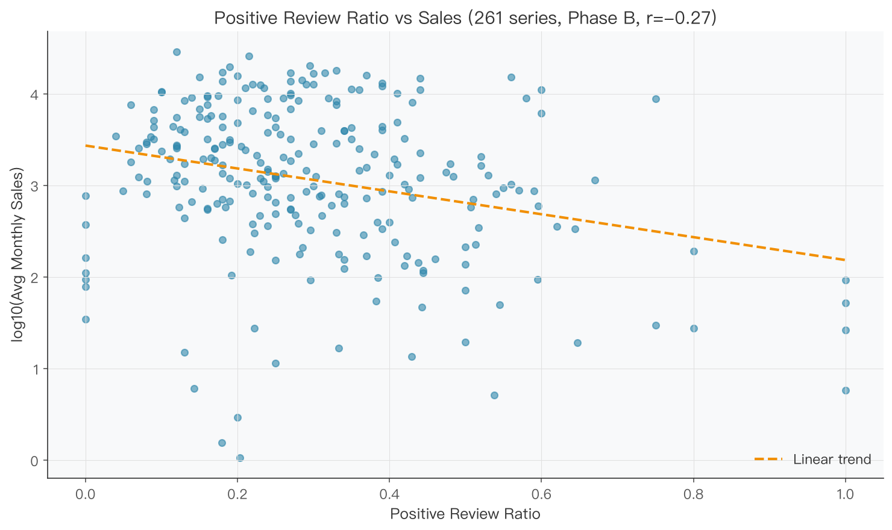
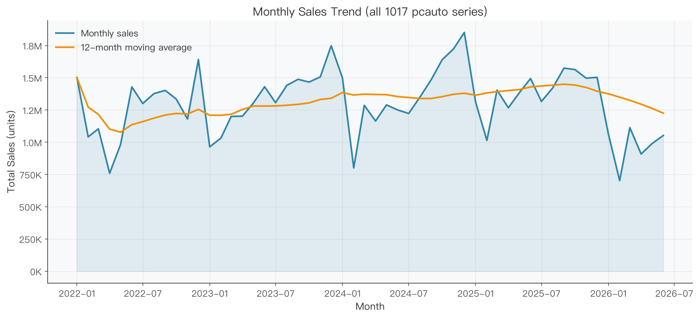
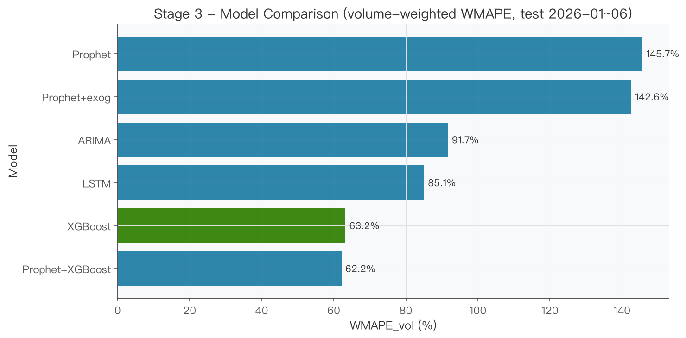
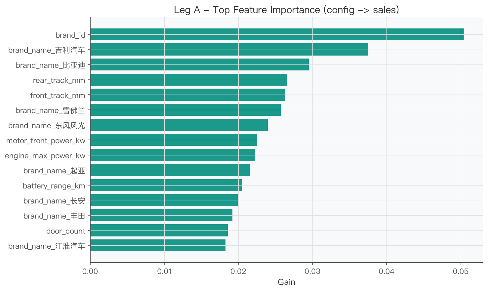

<p align="center">
  <a href="./README.md">🇨🇳 中文</a> &nbsp;|&nbsp; <a href="./README_EN.md">🌐 English</a>
</p>

<h1 align="center">AutoPulse: Automotive Sales Forecasting & User Sentiment Analysis</h1>

<p align="center">
  Multi-source automotive data + user word-of-mouth sentiment + sales forecasting & attribution →
  an end-to-end analytics pipeline and interactive web dashboard.
</p>
<video src="https://github.com/user-attachments/assets/977dd7cc-c016-4697-8468-beba9ce47ff1" width="900" controls></video>

---

## Project Overview

**AutoPulse** is an automotive data-insights project that connects two public data sources — **PCauto monthly sales** and **vehicle specification parameters** (Autohome/PCauto) — to deliver a **no-sentiment baseline** (sales forecasting + config attribution) first, then onboard user-review sentiment (**Phase B**). It answers three core questions:

1. **How many cars will we sell next month?** — Sales forecasting with ARIMA / Prophet / XGBoost / LSTM / ensemble models.
2. **Does user sentiment really affect sales?** — Deep ABSA (Aspect-Based Sentiment Analysis) with a large language model, plus SHAP / Granger causality to quantify the impact.
3. **How do we monitor it continuously?** — Package all previous findings into a pure-static HTML + ECharts interactive web dashboard with brand → series drill-down, sentiment alerts, and attribution visualizations.

> This is a portfolio-grade data-analysis & development project: from raw data collection, cleaning, modeling, attribution, and finally to an interactive dashboard.

---

## Online Dashboard

- 🌐 **Live demo**: https://yemyu.github.io/AutoPulse/
- Local preview: `cd app && python -m http.server 8000`, then open http://localhost:8000/ in your browser.

> Full setup, local run, and data refresh are in **Quick Start** below.

---

## Six-Stage Workflow

The project is organized into six real-world stages, corresponding to the `06_` ~ `20_` pipeline scripts in `scripts/new_pipeline/` and the `notebook/AutoPulse_Analysis_EN.ipynb`.

> The **no-sentiment baseline** is complete: Stages 1–4 (data / filtering / monthly forecasting + config attribution). The sentiment-related Stages 5–6 belong to **Phase B (pending, new-data)**; the methodology is ready and will be redone on the new 371-series scope.

### Stage 1 · Data Preparation

**Question**: How do we align two public sources — PCauto monthly sales and vehicle specifications (Autohome/PCauto)?

**Approach**:
- Collect `monthly_sales.csv` (1,017 series / 54,918 monthly records, 2022-01~2026-06, from pcauto).
- Collect `feature.csv` (766 series / 2,084 rows / 84 columns; grain = **series × year**, `(series_name, year)` unique key, with `annual_sales` yearly-sum; from Autohome/PCauto).
- Align the two datasets directly by `series_name` (the new pipeline needs no legacy `series_mapping` bridge):

```
monthly_sales ──series_name──┐
                             ├──> align → 371 series with monthly+config (Leg B) + 736 series with yearly sales (Leg A)
feature       ──series_name──┘
```

**Result**: Alignment yields 371 in-population series (Leg B monthly forecast) and 736 series with yearly sales (Leg A config attribution); 646 sales-only series without config are excluded.

<p align="center">
  
</p>

---

### Stage 2 · Data Filtering & Exploratory Visualization

**Question**: Which series are suitable for forecasting, and what does the overall market look like?

**Approach**:
- Filter the monthly panel by continuous coverage; final modeling uses 371 in-population series (monthly sales + config complete).
- Visualize market sales trend, segment / energy-type distribution, and price & hardware features.

**Result**:
- 371 series enter Leg B monthly modeling; 736 series enter Leg A yearly attribution.
- Macro features such as EV share, segment distribution, and head concentration are identified.

<p align="center">
  
</p>

---

### Stage 3 · Sales Forecasting Modeling (Leg B, no sentiment)

**Question**: Among time-series models, which forecasts monthly sales most robustly? Are config / external regressors useful?

**Approach**:
- On 371 in-population series, split by **absolute time**: `train` 2022-01~2025-06 / `val` 2025-07~2025-12 / `test` 2026-01~2026-06 (see `data/processed_new/splits/`).
- Compare ARIMA / Prophet / Prophet+exogenous / XGBoost / LSTM; XGBoost does recursive multi-step (6-month) forecasting with early-stopping on val.
- Metrics: WMAPE (volume-weighted + per-series median, both reported, robust to long-tail) + feature ablation + 90% prediction intervals.

**Result**:
- **XGBoost** is the monthly-forecast baseline: test volume-weighted WMAPE **63.2%** (per-series median 59.4%).
- Ablation shows **historical sales lag features dominate**: dropping lag → 73.2%; config features give **no positive contribution** in monthly forecasting (NO-CONFIG 48.8% is actually lower — the old "config +16%" was a future-config leakage artifact, now fixed).
- Error grows with forecast horizon, as expected.

<p align="center">
  
</p>

---

### Stage 4 · Config → Sales Attribution (Leg A, no sentiment)

**Question**: What kind of configuration sells well? How much can configuration explain sales variation?

**Approach**:
- **Series × year cross-sectional regression**: target `y = log1p(annual_sales)`; `GroupKFold(5) by series_name` (prevents same-series leakage across folds, since a series' config is nearly constant year over year).
- Features = config (price/size/energy/power/battery…) + brand + year; explain each dimension's contribution with XGBoost importance.

**Result**:
- R² progresses: year-only **0.089** → +brand **0.154** → +config **0.303** (config increment ΔR² = +0.149).
- Feature importance: config **76.1%** / brand **22.5%** / year **1.4%**.
- Conclusion: config explains variation **between series** (pricier / larger / electric models sell more); within-series year-over-year swings are driven by non-config factors (generation change, incentives, word-of-mouth).

<p align="center">
  
</p>

---

### Stage 5 · Sentiment Fusion Forecasting & Topic Alerts (Phase B pending)

**Question**: Does adding dynamic sentiment improve sales forecasting? Which topics need alerts?

**Approach (planned)**: Redo on the new scope (371 series) — LLM ABSA aspect scoring, dynamic sentiment as exogenous regressor, TF-IDF/LDA topic clustering, rule-based alerts.

**Result**: To be added once Phase B lands on new data. Legacy-pipeline (669 series) experience: dynamic sentiment did **not** improve volume-weighted accuracy (XGBoost-baseline 34.79% vs +Top3sent 35.21%), but lowered per-series WMAPE for tail / low-volume series (327% → 311%).

---

### Stage 6 · Interactive Web Dashboard

**Question**: How can non-technical stakeholders browse all findings in a "problem → evidence → conclusion" narrative?

**Approach**:
- Build a **HTML + ECharts** 7-screen pure-static dashboard: Overview, Sales Forecasting, Sentiment ABSA, Attribution, Sentiment↔Sales Relation, Alerts, and Brand/Series Drill-down.
- Data is pre-baked into `app/static/data/*.json` by `app/build_dashboard_data.py`; the frontend fetches it directly — no backend service needed.
- Supports Chinese/English switching; brand and series drill-down tabs are cross-linked.

**Result**: Launch locally and interactively explore all analysis conclusions in a browser, without re-running models.

> Note: the dashboard data bridge currently reflects the initial-pipeline snapshot; it will be refreshed to the 371-series new scope once Phase B lands.

### Dashboard Screenshots

<details>
  <summary><b>Full dashboard screenshots (click to expand)</b></summary>

<p align="center">
  Click any image to view it at full resolution.
</p>

<table align="center">
  <tr>
    <td align="center" width="50%"></td>
    <td align="center" width="50%"></td>
  </tr>
  <tr>
    <td align="center">Overview</td>
    <td align="center">Sales Forecast</td>
  </tr>
  <tr>
    <td align="center" width="50%"></td>
    <td align="center" width="50%"></td>
  </tr>
  <tr>
    <td align="center">Sentiment ABSA</td>
    <td align="center">Attribution</td>
  </tr>
  <tr>
    <td align="center" width="50%"></td>
    <td align="center" width="50%"></td>
  </tr>
  <tr>
    <td align="center">Sentiment↔Sales Relation</td>
    <td align="center">Alerts</td>
  </tr>
  <tr>
    <td align="center" colspan="2"></td>
  </tr>
  <tr>
    <td align="center" colspan="2">Brand/Series Drill-down</td>
  </tr>
</table>

</details>

---

## Quick Start

### Environment

Dependencies are listed in `requirements.txt`. Install them in any Python environment you prefer (venv, conda, or system-wide):

```bash
pip install -r requirements.txt
```

### Launch the web dashboard (local)

```bash
cd app && python -m http.server 8000
```

Open the browser at http://localhost:8000/ to preview. (The dashboard is a static site and needs no backend server.)

### Live demo

- 🌐 **Live demo**: https://yemyu.github.io/AutoPulse/
- The dashboard data is already pre-baked into `app/static/data/*.json`, so **no crawling or modeling scripts need to be run to view it**. To refresh the data bridge locally (requires having run the full pipeline, i.e. `data/processed_new/*.csv` present), run:

```bash
python app/build_dashboard_data.py
```

---

## Directory Structure

```
AutoPulse/
├── app/                           # Stage 6 · pure-static web dashboard (HTML + ECharts, GitHub Pages)
│   ├── index.html / forecast.html / …  # 7 static pages
│   ├── build_dashboard_data.py    # Pre-bake JSON data bridge
│   ├── .nojekyll                  # disable GitHub Pages' Jekyll
│   └── static/                    # CSS/JS/JSON data
├── data/                          # Data directory (CSVs gitignored)
│   ├── README.md                  # Data docs (Chinese)
│   ├── README_EN.md               # Data docs (English)
│   ├── raw/                       # monthly_sales.csv, feature.csv
│   ├── sentiment/                 # review details & aggregates
│   └── processed_new/             # stage artifacts (new pipeline, reproducible)
├── figures/                       # Analysis charts, dashboard screenshots, and interactive demo (committed)
├── LICENSE                        # MIT license
├── notebook/                      # Bilingual analysis notebooks
│   ├── AutoPulse_Analysis.ipynb
│   └── AutoPulse_Analysis_EN.ipynb
├── scripts/                       # 01_~20_ pipeline scripts
├── config/                        # Config & .env template
├── requirements.txt               # Python dependencies
├── README.md                      # This file (Chinese)
└── README_EN.md                   # English version
```

---

## Tech Stack

- **Data collection**: Python `requests` + `BeautifulSoup` / Dongchedi review API
- **Data processing**: Pandas, NumPy, ETL pipelines
- **NLP**: jieba, Hugging Face Transformers, DeepSeek API (ABSA)
- **Machine learning / time-series**: scikit-learn, XGBoost, Prophet, statsmodels, PyTorch (LSTM)
- **Visualization**: Matplotlib, ECharts (web dashboard)
- **Web dashboard**: vanilla HTML/CSS/JS, ECharts 5 (pure static, GitHub Pages hosted)
- **Dependency management**: `requirements.txt`

---

## Data Notes

- All data come from **public automotive platforms** (PCauto monthly sales, Autohome/PCauto vehicle specs; user-review sentiment is Phase B, separately from Dongchedi).
- Raw / intermediate data is large and gitignored; follow the "Quick Start" steps to launch the dashboard directly after cloning.
- Data copyright belongs to the original platforms. This project is for learning, research, and demonstration only, not commercial use.

Detailed data dictionary, missing-value notes, and quality report are in `data/README.md` (with English version `data/README_EN.md`).

---

## Acknowledgments

- Data are sourced from **Dongchedi** (user reviews, vehicle specifications) and **PCauto** (monthly sales). Thanks to these platforms for the public data that supports this project's research and demonstration.
- Data copyright belongs to the original platforms; this project is for learning, research, and demonstration only, in compliance with their terms of use.

---

*License: MIT (applies to project code and documentation only; data copyright belongs to the original platforms, please comply with their terms of use).*
