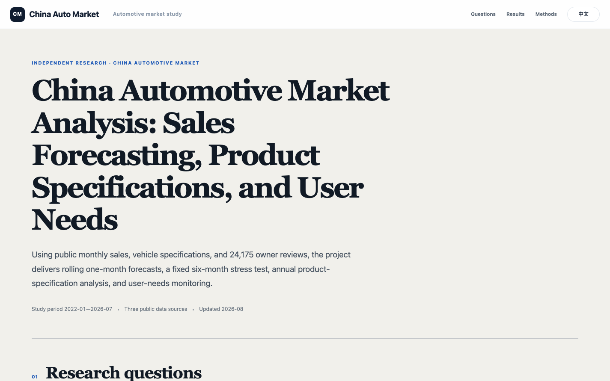
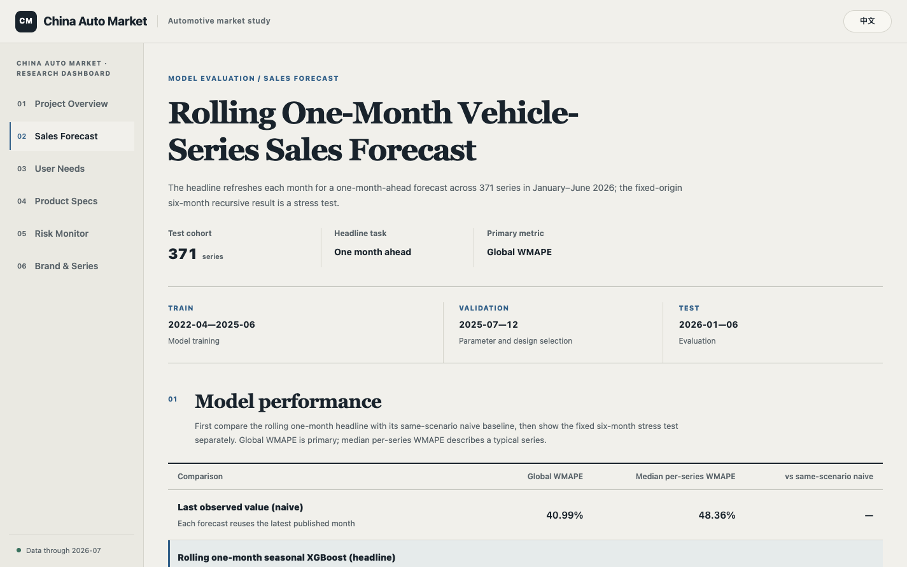
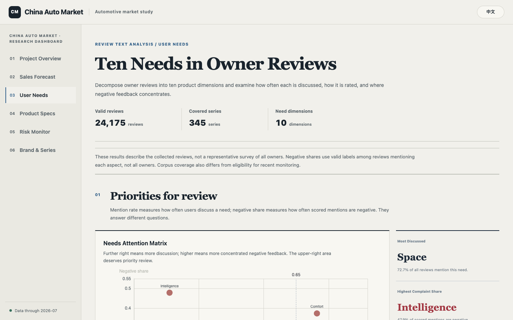
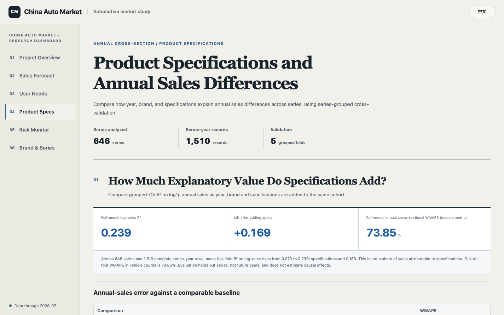
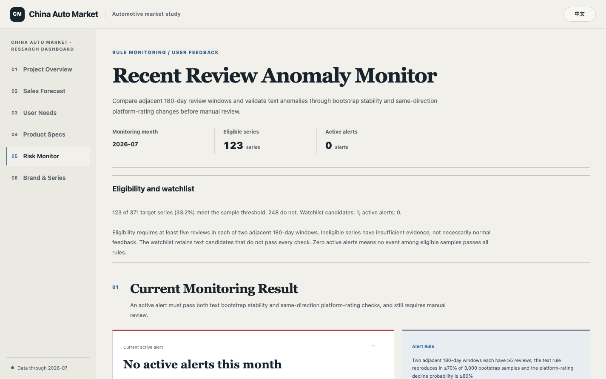
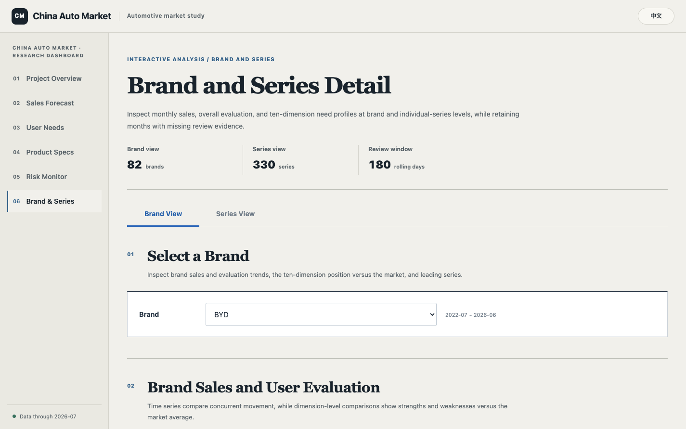

<p align="center">
  <a href="./README.md">中文</a> · <a href="./README_EN.md">English</a>
</p>

<h1 align="center">China Automotive Market Analysis: Sales Forecasting, Product Specifications, and User Needs</h1>

<p align="center">
  An automotive market study using public monthly sales, vehicle specifications, and 24,175 owner reviews
</p>

<p align="center">
  <a href="https://yemyu.github.io/china-auto-market-analysis/"><b>Live research dashboard</b></a>
  ·
  <a href="./notebook/China_Auto_Market_Analysis_EN.ipynb">Analysis notebook</a>
  ·
  <a href="./data/README_EN.md">Data documentation</a>
</p>

---

## Overview

The project has three parts.

| Module | Sample | Scope | Validation |
|---|---:|---|---|
| Six-month sales forecast | 371 series | Measure the contribution of sales history, product attributes, and owner feedback | Fixed-origin recursive forecast with chronological train, validation, and test periods |
| Product-specification analysis | 736 series; 2,007 series-year records | Estimate the incremental explanatory power of year, brand, and product specifications | Five-fold `GroupKFold` by series |
| User needs and risk | 24,175 reviews across 345 series | Identify ten product needs, negative concentration, and emerging review issues | Schema checks, manual sampling, and adjacent 180-day monitoring windows |

Sales forecasting requires continuous monthly history and usable specifications. Product analysis only requires aligned annual sales and specifications. User-needs analysis retains complete, traceable review text.

## Main findings

### Sales forecasting

The final test covers January–June 2026: 2,226 series-month observations across 371 series. Global volume-weighted WMAPE is the primary metric, with median per-series WMAPE reported alongside it.

| Model | Global WMAPE ↓ | Median per-series WMAPE ↓ | vs. best naive baseline |
|---|---:|---:|---:|
| Trailing six-month mean (best naive) | 70.11% | 90.02% | — |
| Sales baseline | 40.44% | 49.98% | −29.67 pp |
| Owner-feedback enhanced | 38.71% | 48.83% | −31.41 pp |
| Cold-start supplement | **38.64%** | **48.32%** | **−31.47 pp** |

The final method reduces absolute forecast error by 44.9% relative to the best naive baseline. Owner feedback provides a modest incremental signal on top of the sales model but does not displace sales history. A series-cluster bootstrap gives a 95% interval of −0.78 to 5.02 percentage points, which still crosses zero. The cold-start method mainly helps nine series with insufficient history and changes the full-sample score by a further 0.06 percentage points.

> Data-repair status: a full rules-based scan covers all 54,918 rows and 1,017 series, and a ten-series batch-recollection pilot checks another 540 series-months. The overlay now repairs 60 series-months and restores a net 1,357,487 units; these include zero-value gaps and four incorrect nonzero values. Both critical risks are closed; external review now contains 21 high- and 33 medium-priority targets. The scan also finds that the prior 24-month eligibility rule counts padded rows rather than positive-sales history. The table therefore remains a frozen pre-repair benchmark; all models and comparisons will be recomputed after high-priority verification and lifecycle-aware cohort reconstruction. See the [data-repair audit](./data/README_EN.md#data-quality-and-repair-processeddat_quality).

### Product specifications

Year, brand, and specifications are added sequentially on the same 736-series sample.

| Feature set | Grouped CV R² | WMAPE |
|---|---:|---:|
| Year | 0.089 | 87.67% |
| Year + brand | 0.156 | 83.92% |
| Year + brand + specifications | **0.300** | **75.69%** |

Specifications add `0.144` to cross-validated R². This is an out-of-fold explanatory association, not a causal estimate.

### User needs and risk

Reviews are represented across ten dimensions: space, power, handling, comfort, energy consumption, equipment, intelligence, value, exterior, and interior. The pipeline stores mention status, polarity, and time availability separately. July 2026 is the latest complete monitoring month; 123 series meet the sample threshold and one current alert is queued for manual review.

## Study design

### Temporal split and leakage controls

| Split | Period | Purpose |
|---|---|---|
| Train | through 2025-06 | Model fitting |
| Validation | 2025-07—12 | Hyperparameter and design selection |
| Test | 2026-01—06 | Final evaluation |

The primary six-month test is a fixed-origin recursive forecast starting in January 2026. Review features are frozen at that origin: no review published on or after 1 January 2026 enters the main result. Rolling-origin results are retained only as supplementary analysis.

### Review corpus

The strict corpus keeps reviews with complete text, publication time, and an auditable source. Another 103 list-page summaries could not be resolved to full review text; they remain in crawl audit files but are excluded from modeling. The resulting corpus contains 24,175 reviews across 345 target series. At the test origin, 330 series have prior review evidence.

Platform ratings and text-based evidence remain separate. Monthly modeling features include historical review volume, dimension scores, positive and negative shares, and mention rates under one consistent detector. Missing review evidence stays missing and receives explicit availability flags rather than being imputed as neutral.

### Metrics

Global WMAPE is:

```text
Σ |actual sales − forecast sales| / Σ actual sales
```

It weights error by observed volume and is therefore suited to the market-level forecast. Median per-series WMAPE supplements the long-tail view. The annual specification analysis additionally reports grouped cross-validated R².

## Dashboard

The bilingual dashboard uses vanilla HTML, CSS, JavaScript, and ECharts. Data is pre-baked into `app/static/data/`, so no backend is required. Six pages cover the project overview, sales forecast, user needs, product specifications, risk monitoring, and brand/series detail.

<details open>
  <summary><b>Dashboard gallery</b></summary>

<br>

<table>
  <tr>
    <td width="50%"><a href="./assets/dashboard/en/01-overview.png"></a></td>
    <td width="50%"><a href="./assets/dashboard/en/02-sales-forecast.png"></a></td>
  </tr>
  <tr><td align="center">Project overview</td><td align="center">Sales forecast</td></tr>
  <tr>
    <td><a href="./assets/dashboard/en/03-user-needs.png"></a></td>
    <td><a href="./assets/dashboard/en/04-product-config.png"></a></td>
  </tr>
  <tr><td align="center">User needs</td><td align="center">Product specifications</td></tr>
  <tr>
    <td><a href="./assets/dashboard/en/05-risk-monitor.png"></a></td>
    <td><a href="./assets/dashboard/en/06-brand-series.png"></a></td>
  </tr>
  <tr><td align="center">Risk monitor</td><td align="center">Brand and series (BYD example)</td></tr>
</table>

</details>

## Quick start

Install the dependencies:

```bash
pip install -r requirements.txt
```

Launch the dashboard (data is pre-baked; no crawl or modeling required):

```bash
python -m http.server 8000 --directory app
```

Open <http://127.0.0.1:8000/>.

Rebuild dashboard data:

```bash
python app/build_dashboard_data.py
```

The reproducible pipeline lives in `scripts/`:

```text
00–14  series index, sales panel, temporal splits, and baseline models
15–28  review collection, series mapping, corpus audits, and review features
29     annual product-configuration attribution
30–37  label merging, forecast ablation, robustness, user needs, cold-start handling, and report notebooks
38–41  direct/naive forecast experiments and full sales/series-mapping repair audits
```

## Repository layout

```text
china-auto-market-analysis/
├── app/                    static dashboard and pre-baked JSON
├── assets/                 analysis figures and dashboard captures
├── data/
│   ├── raw/                monthly sales and vehicle specifications
│   ├── reviews/            review corpus, labels, and temporal features
│   ├── processed/          splits, model outputs, and audit artifacts
│   └── resources/          historical review resources
├── notebook/               Chinese and English analysis notebooks
├── scripts/                reproducible scripts
├── environment.yml
├── requirements.txt
├── README.md
└── README_EN.md
```

## Data and license

Monthly sales, vehicle specifications, and owner reviews come from public automotive platforms. Source-platform data remains subject to the respective owners' rights and is included only for learning, research, and project demonstration. Project code and documentation are released under the MIT License.

See [data/README_EN.md](./data/README_EN.md) for schemas, sample selection, temporal availability, and the curated resource archive.
