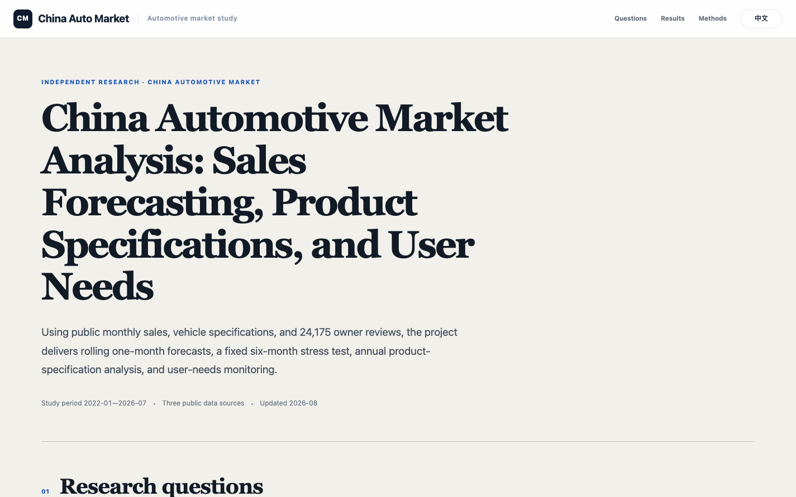
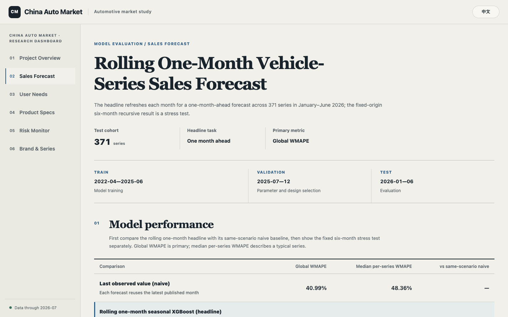
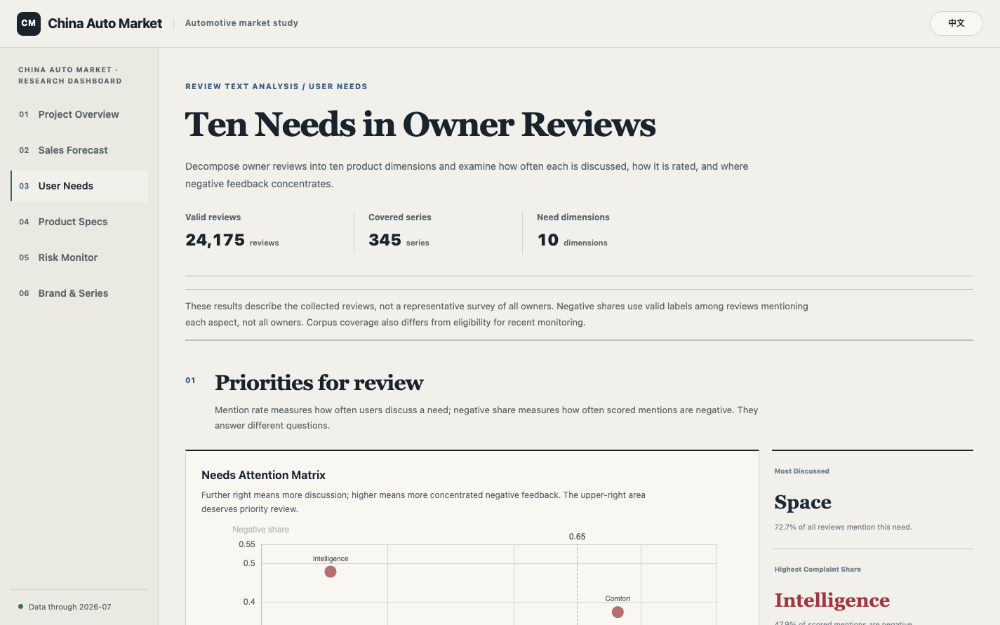
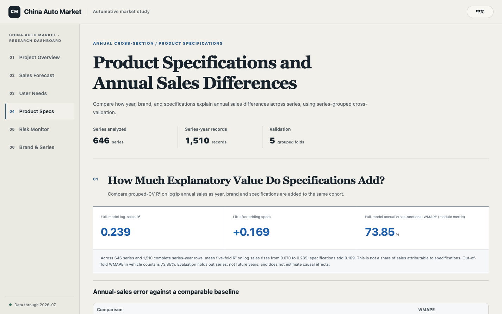
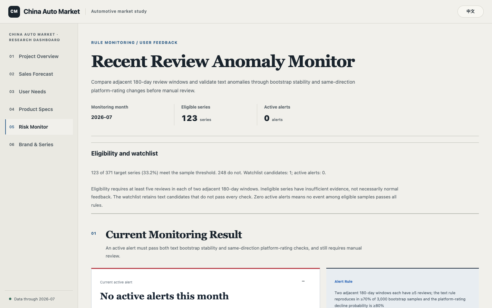
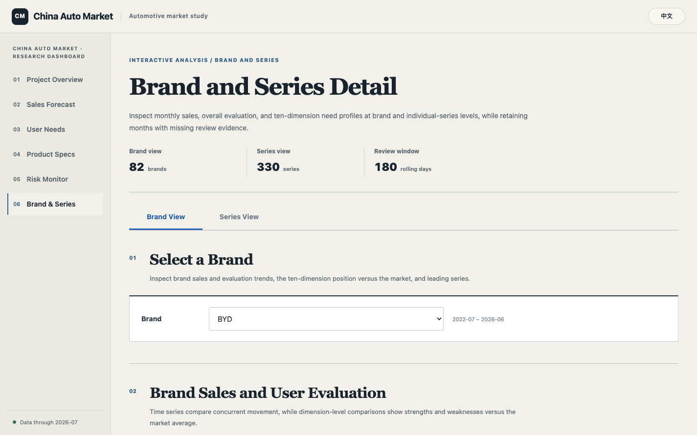

<p align="center">
  <a href="./README.md">中文</a> · <a href="./README_EN.md">English</a>
</p>

<h1 align="center">🌍 China Automotive Market Analysis: Sales Forecasting, Product Specifications, and User Needs</h1>

<p align="center">A research project based on public monthly sales, vehicle specifications, and 24,175 owner reviews</p>

<p align="center">
  <a href="https://yemyu.github.io/china-auto-market-analysis/"><b>Live research dashboard</b></a>
  · <a href="./notebook/China_Auto_Market_Analysis_EN.ipynb">Analysis notebook</a>
  · <a href="./data/README_EN.md">Data documentation</a>
</p>

---

> **Overview**　Public monthly sales, vehicle specifications, and owner reviews are used to study short-term sales changes, the relationship between product attributes and annual sales, and user needs and complaints.

## Research questions

1. 📈 Can next-month series sales be forecast reliably as information is refreshed each month?
2. 🧩 Which product specifications explain annual sales differences between series?
3. 💬 Which user needs are most visible in reviews, and which signals merit follow-up?

## Analysis scope

| Module | Sample | Question | Current protocol |
|---|---:|---|---|
| 📈 Rolling one-month sales forecast | 371 series | Forecast next month with the latest published sales | Primary result; complete monthly panel and time-based splits |
| 🧪 Fixed six-month stress test | Same 371 series | Recursively forecast six months from 2026-01 | Supporting scenario; evaluated separately |
| 🧩 Product-specification analysis | 646 series, 1,510 complete series-year records | Estimate the incremental explanatory value of year, brand, and specifications | Complete 2022–2025 calendar years; five-fold `GroupKFold` by series |
| 💬 User needs and risk | 24,175 reviews across 345 series | Identify ten feedback dimensions, negative sentiment, and unusual changes | Structural checks, sample review, adjacent 180-day windows |

Forecasting uses a complete monthly panel for a fixed cohort. Specification analysis uses complete annual records with aligned sales and attributes. User-needs analysis uses complete, traceable review text. Eligibility rules and input fields are described in the [data guide](./data/README_EN.md).

## Key metrics

| Key finding | Current result |
|---|---:|
| 📈 Rolling one-month forecast | **29.75% WMAPE**, 11.24 percentage points below the last-value baseline |
| 🧪 Fixed six-month stress test | **38.09% WMAPE**, 43.5% lower absolute error than the trailing-twelve-month mean |
| 🧩 Annual specification model | Grouped-CV R² on log sales: **0.239**; specification increment: **+0.169** |
| 💬 User-needs monitoring | 24,175 reviews, 10 dimensions, 123 qualifying series |

## Main results

### 1. 📈 Sales forecasting

The evaluation window is January–June 2026: 371 series and 2,226 series-month observations. The primary task forecasts one month ahead using information updated each month. The fixed-origin six-month forecast is evaluated as a stress test. Global volume-weighted WMAPE is the primary metric; median per-series WMAPE describes performance across series.

#### Rolling one-month forecast

| Method | Global WMAPE ↓ | MAE (vehicles) ↓ | RMSE (vehicles) ↓ | Median per-series WMAPE ↓ |
|---|---:|---:|---:|---:|
| Last observed value | 40.99% | 975.19 | 2,668.17 | 48.36% |
| Trailing 3-month mean | 43.61% | 1,037.52 | 2,614.45 | 53.66% |
| Trailing 6-month mean | 51.21% | 1,218.19 | 2,892.08 | 64.45% |
| Same month last year | 73.88% | 1,757.68 | 3,590.51 | 100.00% |
| **Seasonal XGBoost** | **29.75%** | **707.68** | **1,700.38** | **36.83%** |

MAE and RMSE are measured in vehicles, calculated across series-month observations. The model reduces absolute error by 27.4% against the last-value baseline. Median absolute error is 139 vehicles; the 90th percentile is about 1,960.

**Historical evaluation and model selection.** Each of four forecast origins—January and July in 2024 and 2025—covers six successive one-month forecasts. The base XGBoost uses 1/2/3-month lags, 3/6-month means, calendar variables, and specifications. The seasonal model adds a 12-month lag and mean, with changes to tree depth, tree count, and other parameters. The comparison therefore includes both feature and parameter changes.

Pooled historical WMAPE falls from 24.30% to 23.35%, an improvement of 0.957 percentage points. The largest deterioration at a single origin is 0.061 points, meeting the preset criteria of at least 0.5 points pooled improvement and no more than 1 point deterioration at any origin. The selected model is refitted on data through December 2025. Weights and parameters remain fixed throughout January–June 2026, while sales history is updated each month. Origin-level results and parameters are available in the [notebook](./notebook/China_Auto_Market_Analysis_EN.ipynb) and [evaluation summary](./data/processed/forecast/rolling_origin_summary.json).

**Monthly and group-level errors.** The model beats the last-value baseline in five of six test months. May WMAPE is 21.77%, compared with 21.02% for the baseline. Quartile groups defined using average sales over the six pre-test months have 66.60% WMAPE in the lowest-volume group and 28.02% in the highest. Monthly, group-level, and zero-sales diagnostics are reported in the notebook.

| Other views of error | Last-value baseline | Seasonal XGBoost |
|---|---:|---:|
| Positive-sales MAPE (1,964 rows) ↓ | 255.51% | 179.75% |
| sMAPE (all 2,226 rows) ↓ | **52.44%** | 61.39% |
| WMAPE after summing the 371 series within each month ↓ | 28.32% | **6.46%** |
| Six-month net bias (prediction minus actual) | +9.54% | −0.67% |

sMAPE assigns 200% to a zero actual with a positive prediction. On the 262 zero-sales observations, model MAE is 23.06 vehicles versus 34.87 for the baseline. The model more often predicts small positive values, resulting in higher sMAPE. Monthly aggregate WMAPE measures errors in total sales for the sampled series; net bias measures over- or underprediction across the full six months. Both allow individual errors to cancel.

#### Fixed six-month stress test

| Method | Global WMAPE ↓ | Median per-series WMAPE ↓ |
|---|---:|---:|
| Fixed-origin trailing six-month mean (naive) | 69.31% | 89.60% |
| Fixed-origin trailing twelve-month mean (naive) | 67.43% | 89.40% |
| Fixed six-month platform-rating model (XGBoost) | **38.09%** | **48.18%** |

The platform-rating model has MAE of 906.21 vehicles and reduces absolute error by 43.5% against the trailing-twelve-month mean. This mean has the lowest test WMAPE among the saved naive methods and is a descriptive reference; the platform-rating model was selected during development. See the [full fixed-origin comparison](./data/processed/forecast/forecast_benchmark_comparison.csv).

**Review-feature comparison.** The sales baseline, platform-rating, local-lexicon, text, and combined-review variants all use XGBoost, retaining the platform-rating selection and 100 trees per variant from development. Platform ratings lower test WMAPE from 39.07% to 38.09%. Paired resampling of whole series over 5,000 bootstrap replicates gives an improvement of 0.980 percentage points, with a 95% interval of −0.0047 to 2.2331 points. The interval includes zero; evidence for a stable gain remains insufficient. The notebook contains the full comparison and interval plot.

**Limited sales history.** The thirteen series with no positive pre-origin sales use the same platform-rating model and have fixed-origin WMAPE of about 99.40%. Predicting sales ramp-up for new series remains a weakness.

### 2. 🧩 Product specifications and annual sales variation

| Feature combination | Log-sales R²: fold mean ± fold SD | Annual-sales WMAPE (pooled out-of-fold predictions) |
|---|---:|---:|
| Year | 0.013 ± 0.012 | 87.50% |
| Year + brand | 0.070 ± 0.058 | 83.82% |
| Year + brand + specifications | **0.239 ± 0.073** | **73.85%** |
| Specifications only | 0.197 ± 0.086 | 76.05% |

The model fits `log1p(annual sales)`, and R² is calculated on that scale. Adding specifications increases R² by 0.169. WMAPE uses pooled out-of-fold predictions converted back to vehicle counts. The ± values are standard deviations across five folds.

The analysis uses complete 2022–2025 calendar years with five-fold cross-validation grouped by series. Imputation and encoding are fitted within each training fold. Evaluation covers series excluded from model fitting. A year-specific median baseline fitted on the same training folds has 87.21% WMAPE, compared with 73.85% for the full model.

Feature importance uses XGBoost gain to measure the reduction in loss from tree splits. The analysis compares associations between product attributes and annual sales; records are at series-year level, and prices are list prices.

### 3. 💬 User needs and risk

Reviews record mentions, sentiment, and time windows for ten dimensions: space, power, handling, comfort, energy use, equipment, smart features, value, appearance, and interior. Monitoring first identifies candidates using text rules. A candidate must reproduce the rule in at least 70% of 3,000 bootstrap samples and show a decline in the original platform rating in at least 80% of rating resamples. Twelve of 60 historical text candidates pass both checks. In the latest complete month, July 2026, 123 series meet the monitoring threshold, with no active dual-signal alert and one watchlist candidate.

Complaint keywords are ranked by their distinctiveness in negative versus positive reviews. Common findings include thin paint, plastic-heavy interiors, cramped rear seating, weak acceleration, tyre noise, high fuel consumption, reduced equipment, infotainment problems, and high prices. These provide leads for reviewing product feedback and conducting interviews.

Mention share uses all eligible reviews as its denominator; negative share uses scored mentions of the relevant aspect. The notebook reports both counts.

The 123 eligible series represent 33.2% of the 371-series target cohort. Other series do not meet the minimum of five reviews in each adjacent 180-day window. Monitoring results apply to eligible series; potential issues need further review of source comments, sample sizes, and rating changes.

## Research design and information availability

| Segment | Period | Use |
|---|---|---|
| Train | Through 2025-06 | Model fitting |
| Validation | 2025-07—12 | Parameter and protocol selection |
| Test | 2026-01—06 | Final evaluation |

After model selection, both the rolling and fixed-origin models are refitted on Train+Validation. Weights remain fixed during evaluation. Rolling forecasts update published sales history each month; fixed-origin forecasts recursively generate later sales lags. The notebooks analyse saved results; training commands are in `scripts/`.

Review features are cut off by publication date. Inputs require complete text, publication time, and traceable sources. Missing review coverage is retained as missing values and an availability indicator.

Specification records are limited by forecast origin and matched to the latest record from the same or an earlier year. Preprocessing is fitted within each training window, and specifications stay fixed over the forecast window. Missing-value and unknown-category rules are documented in the [data guide](./data/README_EN.md).

Evaluation and data limitations:

- The January–June 2026 window was examined during development checks and repairs. Results are a retrospective evaluation over a fixed window.
- Review bootstrap intervals are conditional on the fitted models and observed months; they exclude uncertainty from refitting, selection, and future windows.
- Within-year specification release dates and historical sales releases and revisions are unavailable. Evaluation uses annual proxies and assumes previous-month sales have been published.
- Specification cross-validation evaluates generalisation across series; forecasting future years has not been separately evaluated.
- Reviews are self-selected and lack independent, representative label and event validation sets. Label F1 and alert accuracy have not been established. Monitoring identifies current feedback signals; future faults and sustained deterioration have not been validated.

Global WMAPE is defined as:

```text
Σ |actual sales − forecast sales| / Σ actual sales
```

WMAPE is reported as a percentage. MAE is mean absolute error and RMSE is root mean squared error. MAPE uses positive actuals only; sMAPE includes all rows and assigns zero when both values are zero. Zero-sales errors remain in MAE, RMSE, and WMAPE. Full formulas and sample counts are available in the notebook.

## Data processing and quality checks

Local processing uses MySQL to store source batches, standardised records, and three analysis datasets across four logical databases and 23 tables. The public repository provides CSV/JSON analysis snapshots; the dashboard reads `app/static/data/` without a database connection.

- Source files are registered by SHA-256; repeated ingestion of the same batch skips writes.
- Tables have defined grains and unique keys. Critical quality failures block publication.
- The monthly pipeline has ten tasks, with dependencies, retries, and run status recorded.
- Unit tests and isolated MySQL integration tests cover data rules, repeated ingestion, and recovery from publication failures.

Implementation is available in the [Python package](./src/china_auto_market/), [SQL](./sql/), [orchestration](./dags/), and [tests](./tests/). The [data guide](./data/README_EN.md) describes data layers and inputs.

## Quick start

Open the [live dashboard](https://yemyu.github.io/china-auto-market-analysis/) to browse online. Local viewing requires only Python, with no analysis dependencies:

```bash
git clone https://github.com/Yemyu/china-auto-market-analysis.git
cd china-auto-market-analysis
python3 -m http.server 8000 --bind 127.0.0.1 --directory app
```

Open `http://localhost:8000` for the Chinese and English pages. On Windows, use `python` in place of `python3` if that is your Python command.

Running analyses requires Python 3.11 or later. The [run guide](./data/README_EN.md#local-setup) covers environment setup, opening notebooks, rebuilding dashboard data, and input requirements for each analysis command. Public analysis snapshots are sufficient to rebuild the dashboard JSON; full review analysis also requires review text that is not distributed with the repository.

## Dashboard

The dashboard uses HTML, CSS, JavaScript, and ECharts. It has six pages—overview, sales forecasts, user needs, product specifications, monitoring, and brand/series details—with Chinese/English switching and brand/series filters.

<details open>
  <summary><b>Dashboard captures</b></summary>

<br>

<table>
  <tr><td width="50%"><a href="./assets/dashboard/en/01-overview.png"></a></td><td width="50%"><a href="./assets/dashboard/en/02-sales-forecast.png"></a></td></tr>
  <tr><td align="center">Project overview</td><td align="center">Sales forecast</td></tr>
  <tr><td><a href="./assets/dashboard/en/03-user-needs.png"></a></td><td><a href="./assets/dashboard/en/04-product-config.png"></a></td></tr>
  <tr><td align="center">User needs</td><td align="center">Product specifications</td></tr>
  <tr><td><a href="./assets/dashboard/en/05-risk-monitor.png"></a></td><td><a href="./assets/dashboard/en/06-brand-series.png"></a></td></tr>
  <tr><td align="center">Risk monitor</td><td align="center">Brand and series (BYD example)</td></tr>
</table>

</details>

## Repository layout

```text
china-auto-market-analysis/
├── app/                    Static research dashboard and generated JSON
├── assets/                 Analysis figures and dashboard captures
├── dags/                   Monthly task orchestration
├── data/                   Raw, processed, and audit data
├── notebook/               Chinese and English analysis notebooks
├── scripts/                Collection, analysis, and engineering commands
├── sql/                    MySQL DDL, staging, marts, and quality rules
├── src/china_auto_market/   Python business logic
├── tests/                  Unit tests, synthetic samples, and MySQL integration
├── environment.yml
├── pyproject.toml
├── requirements.txt
├── README.md
└── README_EN.md
```

## Data and license

Monthly sales, vehicle specifications, and owner reviews come from public automotive platforms. Copyright remains with the respective sources; repository data is for learning, research, and project presentation only, not commercial use. Code and project documentation are released under the MIT License. See [data/README_EN.md](./data/README_EN.md) for schemas, cohort rules, temporal availability, and archived resources.
